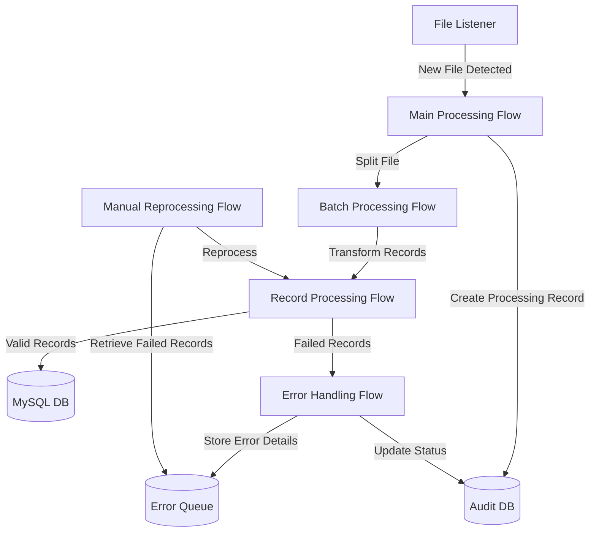

## Scenario: Financial Data File Transfer Integration for Customer Records
### Business Context

FinData Solutions, a financial services provider, receives critical customer financial information in the form of flat files. These files, which contain detailed financial data for customers, are deposited into a secured directory on the company’s file server (FTP) several times a day at random intervals. 
The organization needs to process these files quickly to update a central MySQL database, ensuring that all customer records are accurately reflected for downstream analytics and reporting. 
Due to regulatory and internal compliance requirements, each record must be auditable and fully traceable throughout the integration process, with a robust mechanism for handling and later manually intervening in any processing failures.
Use Case Requirements

File Ingestion:
- Frequency & Timing: Files are uploaded a few times a day at random times.
- Volume: Each file contains approximately one million records of customer financial data.

Processing Objectives:
- Speed: The Mule application must quickly process the entire file after detection.
- Data Persistence: Processed records are to be inserted or updated into a target MySQL database.
- Auditing & Traceability: Every record must be tracked through its lifecycle, from file ingestion to database update.
- Error Handling & Manual Intervention: If processing of any record fails (e.g., data transformation errors, database connectivity issues), these records must be flagged for human review and manual reprocessing.

Infrastructure Constraints:
- Deployment Environment: The Mule application will be deployed to a CloudHub environment on a single worker sized at 0.2 vCore with 1GB of heap memory.
- Resource Efficiency: Given the file size and resource limits, the solution must be designed to be both memory- and CPU-efficient, ensuring that large files can be processed without exhausting resources.

### Exercise Questions
- Describe a high-level flow diagram for processing the file from ingestion to database update, including how auditing and error handling are integrated.
- How do the resource constraints (1GB of heap on a 0.2 vCore worker) influence your choice of processing model?
- Considering the large file size, what strategies would you implement to ensure that the Mule application does not exceed available memory during processing?
- How would you design the error handling sub-flow to capture and store failed records for manual reprocessing?
- Discuss potential trade-offs between processing speed and error handling robustness in your design.

### Guiding Diagram Solution

